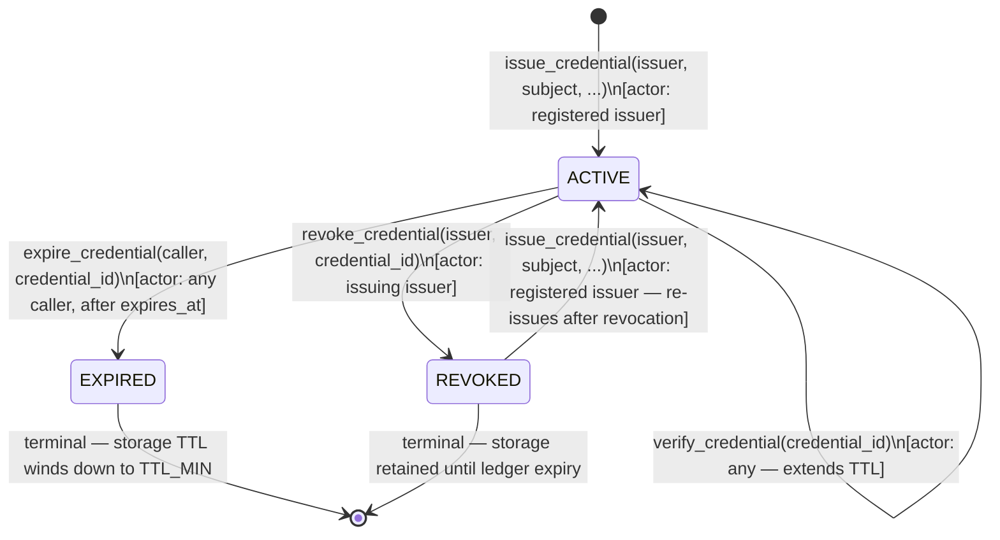
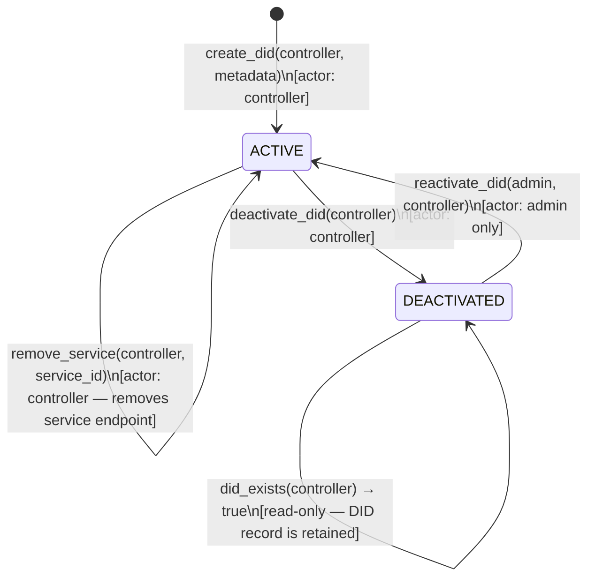

# Architecture

## Overview

Soroban Identity is composed of three layers:

```
┌─────────────────────────────────────────┐
│              dApps / Frontend           │
├─────────────────────────────────────────┤
│           TypeScript SDK                │
│   IdentityClient  |  CredentialClient   │
├──────────────────┬──────────────────────┤
│ identity-registry│  credential-manager  │  ← Soroban contracts
└──────────────────┴──────────────────────┘
         Stellar Network (Soroban)
```

## Contracts

### identity-registry

Manages DID documents on-chain.

| Function | Description |
|---|---|
| `initialize(admin)` | One-time setup |
| `propose_admin(current_admin, proposed_admin)` | Step 1: propose a new admin (current admin only) |
| `accept_admin(new_admin)` | Step 2: accept a pending admin proposal (proposed admin only) |
| `create_did(controller, metadata)` | Mint a new DID |
| `update_did(controller, metadata)` | Update metadata |
| `deactivate_did(controller)` | Soft-delete a DID |
| `resolve_did(controller)` | Read a DID document |
| `has_active_did(controller)` | Boolean check |

### credential-manager

Issues and verifies verifiable credentials. A maximum of **100 issuers** (`MAX_ISSUERS`) can be registered at any time by default; `add_issuer` returns `MaxIssuersReached` if the cap is hit. The admin can raise or lower this cap via `set_max_issuers`, up to a hard ceiling of **500 issuers** (`ABSOLUTE_MAX_ISSUERS`).

| Function | Description |
|---|---|
| `initialize(admin)` | One-time setup |
| `transfer_admin(current_admin, new_admin)` | Transfer admin rights (current admin only) |
| `add_issuer(issuer)` | Register a trusted issuer (admin) |
| `remove_issuer(issuer)` | Remove an issuer (admin) |
| `set_max_issuers(admin, new_max)` | Raise or lower the issuer cap, up to `ABSOLUTE_MAX_ISSUERS` (admin) |
| `issue_credential(issuer, subject, type, claims, claims_hash, sig, expires)` | Issue a credential |
| `revoke_credential(issuer, id)` | Revoke a credential |
| `verify_credential(id)` | Check validity |
| `verify_claims_hash(id, hash)` | Verify off-chain claims hash matches stored hash |
| `get_credential(id)` | Fetch full credential |

## DID Format

```
did:stellar:<bech32-stellar-address>
```

Example: `did:stellar:GABC...XYZ`

The identifier MUST match the following regular expression, where the address
segment is a 56-character Stellar public key (Ed25519, `G...`):

```
^did:stellar:G[A-Z2-7]{55}$
```

This is W3C DID-compatible and portable across any dApp that integrates the SDK.

## Credential Flow

```
Issuer                Subject               Verifier
  │                     │                      │
  │── issue_credential ─▶│                      │
  │                     │── present cred id ──▶│
  │                     │                      │── verify_credential
  │                     │                      │◀─ true / false
```

## Credential Lifecycle

Every credential moves through these states. All transitions are permanent except the implicit re-issuance path for a previously revoked credential.



**Notes:**
- `expires_at = 0` means the credential never expires; only `revoke_credential` can terminate it.
- `expire_credential` is a permissionless sweep — any address can call it once the ledger timestamp exceeds `expires_at`.
- Re-issuance after revocation creates a new credential with a fresh `issued_at`; the revoked record remains in storage.
- `verify_credential` is read-only but bumps the persistent-storage TTL to keep the record alive.

## DID Lifecycle

A DID document is owned by its `controller` (the Stellar wallet that created it). Only the admin can reactivate a deactivated DID.



**Notes:**
- `resolve_did` and `has_active_did` are read-only and only succeed on `ACTIVE` DIDs.
- `did_exists` returns `true` for both `ACTIVE` and `DEACTIVATED` states — it checks presence without deserialising the document.
- Deactivation decrements the active DID counter; reactivation increments it.
- Service endpoints (`add_service` / `remove_service`) are only permitted on `ACTIVE` DIDs; attempting either on a `DEACTIVATED` DID returns `DidDeactivated`.
- A controller address can only hold one DID. `create_did` returns `DidAlreadyExists` if a document already exists for the address.

## Cross-Contract Calls & Reentrancy (Issue #551)

Soroban's execution model prevents classic EVM-style reentrancy at the host
level, but a contract that performs a cross-contract call is still
vulnerable to unexpected state if the called contract were ever changed to
call back into the caller (or into another guarded function) before the
outer call completes.

**Current cross-contract call graph:**

```
credential-manager::issue_credential ──▶ identity-registry::has_active_did
```

This is the only cross-contract call in the codebase today.
`identity-registry::has_active_did` is a read-only storage lookup — it does
not call any other contract, so there is currently **no circular
invocation path**.

**Guard**: `credential-manager::issue_credential` acquires a `ReentrancyGuard`
(an `EXECUTING` flag in instance storage) immediately before invoking
`has_active_did`, and releases it via `Drop` on every normal exit path
(including early `?` returns). A re-entrant call into `issue_credential`
while that flag is set fails closed with `ContractError::ReentrantCall`
instead of proceeding against partially-applied state. This is
defense-in-depth for if a future change makes `has_active_did` (or a
function it delegates to) call back into `credential-manager`; the pattern
should be applied to any new function that performs a cross-contract call.

## Privacy

- Claims are stored on-chain as key-value pairs (public by default)
- For sensitive data, pass a SHA-256 hash of the off-chain claims payload as `claims_hash` to `issue_credential`; the raw claims can be stored off-chain (e.g. IPFS or encrypted storage) and verified on-chain with `verify_claims_hash(id, hash)`
- ZKP integration is planned for selective disclosure without revealing raw claims

## Contract Events

### identity-registry

| Event topic | Payload | Emitted by |
|---|---|---|
| `(IDENTITY, "created")` | `(controller: Address, timestamp: u64)` | `create_did` |
| `(IDENTITY, "updated")` | `(controller: Address, metadata_hash: BytesN<32>)` | `update_did` |
| `(IDENTITY, "deactivated")` | `(controller: Address, timestamp: u64)` | `deactivate_did` |

### credential-manager

| Event topic | Payload | Emitted by |
|---|---|---|
| `(CRED, "issued")` | `(id: BytesN<32>, subject: Address, issuer: Address, type: CredentialType)` | `issue_credential` |
| `(CRED, "revoked")` | `(id: BytesN<32>, issuer: Address)` | `revoke_credential` |

## Storage

- `persistent` storage is used for DID documents and credentials (survives ledger expiry with TTL bumps)
- `instance` storage is used for admin and issuer registry


## Deployment

### Prerequisites

- [Stellar CLI](https://developers.stellar.org/docs/tools/developer-tools/cli/stellar-cli) installed
- Rust toolchain with `wasm32-unknown-unknown` target: `rustup target add wasm32-unknown-unknown`

### 1. Build Contracts

```bash
cargo build --target wasm32-unknown-unknown --release --manifest-path contracts/Cargo.toml
```

Compiled `.wasm` files will be in `contracts/target/wasm32-unknown-unknown/release/`.

### 2. Deploy to Testnet

```bash
# Deploy identity-registry
stellar contract deploy \
  --wasm contracts/target/wasm32-unknown-unknown/release/identity_registry.wasm \
  --source <SECRET_KEY> \
  --network testnet

# Deploy credential-manager
stellar contract deploy \
  --wasm contracts/target/wasm32-unknown-unknown/release/credential_manager.wasm \
  --source <SECRET_KEY> \
  --network testnet
```

Each command prints a contract ID — save these for the next step.

### 3. Initialize Contracts

```bash
# Initialize identity-registry
stellar contract invoke \
  --id <IDENTITY_REGISTRY_CONTRACT_ID> \
  --source <SECRET_KEY> \
  --network testnet \
  -- initialize \
  --admin <ADMIN_ADDRESS>

# Initialize credential-manager
stellar contract invoke \
  --id <CREDENTIAL_MANAGER_CONTRACT_ID> \
  --source <SECRET_KEY> \
  --network testnet \
  -- initialize \
  --admin <ADMIN_ADDRESS>
```

### 4. Deploy to Mainnet

Replace `--network testnet` with `--network mainnet` in all commands above. Mainnet requires funded accounts — use [Stellar Laboratory](https://laboratory.stellar.org) or an exchange to fund your deployer key.

```bash
stellar contract deploy \
  --wasm contracts/target/wasm32-unknown-unknown/release/identity_registry.wasm \
  --source <SECRET_KEY> \
  --network mainnet
```

### 5. Configure the SDK

Pass the deployed contract IDs to the SDK clients:

```typescript
import { IdentityClient } from '@soroban-identity/sdk';

const client = new IdentityClient({
  rpcUrl: 'https://soroban-testnet.stellar.org',       // or mainnet RPC
  networkPassphrase: 'Test SDF Network ; September 2015', // or mainnet passphrase
  identityRegistryId: '<IDENTITY_REGISTRY_CONTRACT_ID>',
  credentialManagerId: '<CREDENTIAL_MANAGER_CONTRACT_ID>',
});
```

### Reference

- [Stellar CLI docs](https://developers.stellar.org/docs/tools/developer-tools/cli/stellar-cli)
- [Soroban contract deployment guide](https://developers.stellar.org/docs/build/smart-contracts/getting-started/deploy-to-testnet)
