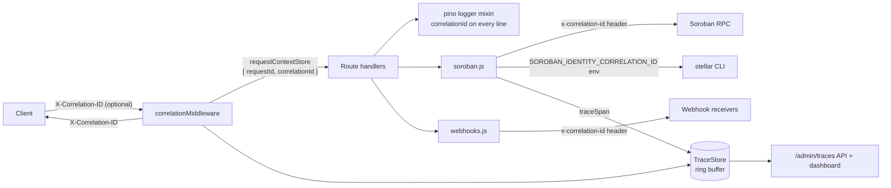

# Request Tracing with Correlation IDs

Issue #946 (BE-15). Source: [`server/src/middleware/tracing.js`](../server/src/middleware/tracing.js).

Every request is tagged with a correlation ID. That ID follows the request through logs, outbound calls, and a queryable trace store. This works alongside the OpenTelemetry and Jaeger spans described in [distributed-tracing.md](./distributed-tracing.md) and [trace-visualization.md](./trace-visualization.md). Those tools need an external collector. Correlation tracing works with none, so you can grep logs for a single ID or open the built-in dashboard.

## Architecture

### ID resolution

1. If the request has an inbound `X-Correlation-ID` that matches `^[A-Za-z0-9._:-]{8,128}$`, use it. This keeps IDs continuous when an upstream gateway or client already assigned one.
2. Otherwise, use an inbound `X-Request-ID` that matches the same pattern.
3. Otherwise, generate a new UUID v4.

IDs that fail the pattern are discarded rather than sanitized. This stops a client from injecting log noise or header content.

### Propagation

| Hop | Mechanism |
| --- | --- |
| Request context | Stored in `AsyncLocalStorage` (`requestContextStore`) next to `requestId` and `tenantId` |
| Logs | The `logger.js` mixin adds `correlationId` to every log line emitted within the request |
| Response | `X-Correlation-ID` header on every response |
| Soroban RPC (`fetch`) | `x-correlation-id` request header via `correlationHeaders()` |
| Stellar CLI (`spawn`) | `SOROBAN_IDENTITY_CORRELATION_ID` env var via `correlationEnv()` |
| Webhook delivery | `x-correlation-id` header, when delivery happens inside a request |

Any new outbound call should spread `correlationHeaders()` into its headers. Any new background job enqueued from a request should copy `getCorrelationId()` into its payload.

### Trace storage

`TraceStore` is an in-memory ring buffer. By default it holds the 1000 most recent traces, configurable with the `TRACE_STORE_MAX_TRACES` env var, and up to 100 spans per trace. Each trace records the following fields:

- `correlationId`
- `requestId`
- `method`
- `path`
- `tenantId`
- `statusCode`
- `startedAt`
- `durationMs`
- `spans[]`

To add a child span, wrap work in `traceSpan(name, fn, attributes)`. Soroban contract invocations are already wrapped as `soroban.invoke <method>`.

The store is per process and is lost on restart. It is meant for debugging recent traffic. For long-term retention, ship logs (which carry `correlationId`) to your log platform, or use the OpenTelemetry exporter.

## Admin API

All endpoints require admin auth and the `admin:read` scope.

| Endpoint | Description |
| --- | --- |
| `GET /admin/traces` | Recent traces, newest first. Query params: `limit` (1–1000, default 100), `status_min`, `path_prefix`, `min_duration_ms` |
| `GET /admin/traces/:correlationId` | One trace with its spans. Returns 404 `trace_not_found` if the ID was evicted or never seen |
| `GET /admin/traces/dashboard` | HTML dashboard: a table of recent traces, and a span waterfall when `?id=<correlationId>` is set |

## Debugging workflow

1. Get the `X-Correlation-ID` from the failing response, a client report, or an upstream gateway log.
2. Open `/admin/traces/dashboard?id=<id>` to see status, timing, and a waterfall of child spans.
3. Search the logs for `correlationId:"<id>"` to see every log line the request produced.
4. If the call reached Soroban RPC or a webhook receiver, search those systems' logs for the same `x-correlation-id`.
