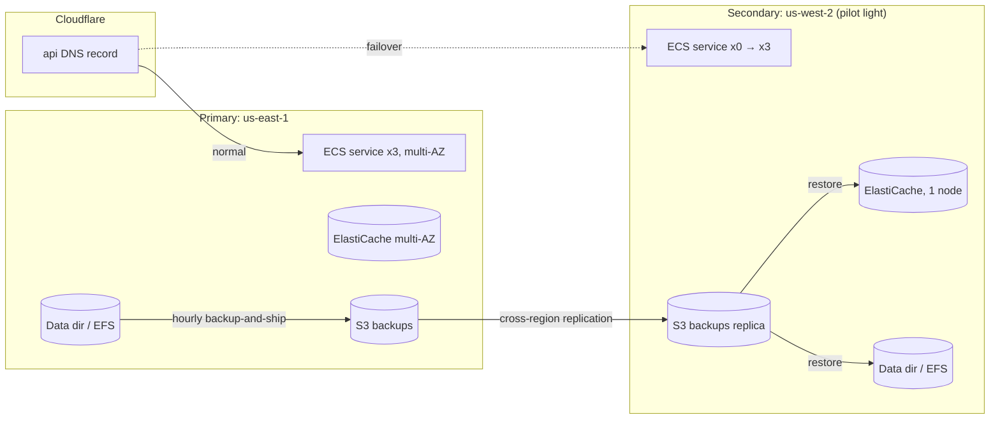

# Disaster Recovery

Issue #945 (INFRA-05). This directory holds the disaster recovery (DR) plan for the Soroban Identity off-chain platform: the API server, its data directory, and Redis.

On-chain state (DIDs, credentials, revocations, reputation) lives in the Soroban contracts on the Stellar network. Stellar's validator set replicates it, so it is outside the scope of this plan. Losing our infrastructure never loses on-chain data. It only takes the API that fronts it offline.

| Document | Purpose |
| --- | --- |
| [README.md](README.md) | Targets, architecture, and scope (this file) |
| [backup-restoration.md](backup-restoration.md) | How to restore each data store from backup |
| [runbook.md](runbook.md) | Step-by-step service recovery for each disaster scenario |
| [failover-testing.md](failover-testing.md) | Quarterly failover drill procedure and results log |
| [contacts.md](contacts.md) | Emergency contacts and escalation path |
| [terraform/](terraform/) | Secondary-region standby infrastructure |
| [scripts/](scripts/) | Automation: backup shipping, failover, verification, drills |
| [crontab](crontab) | Schedules for backup shipping and the quarterly drill |

## RPO and RTO targets

The RPO (recovery point objective) is the maximum acceptable data loss, measured as time. The RTO (recovery time objective) is the maximum acceptable time from declaring a disaster to restoring service.

| Component | Data | RPO | RTO | How the target is met |
| --- | --- | --- | --- | --- |
| API server (ECS) | Stateless | n/a | **1 h** (region loss) / **15 min** (task or AZ loss) | Multi-AZ ECS service. A pilot-light service in the secondary region is scaled up by `failover.sh` |
| Data directory | Credential index, webhooks, webhook and notification logs, expiry watermark, audit logs | **1 h** | **1 h** | Hourly `backup-and-ship.sh` to S3, with cross-region replication to the secondary bucket |
| Redis (ElastiCache) | Query and DID cache, rate-limit and quota counters, job queues | **24 h** (queues) / none (cache) | **30 min** | Multi-AZ automatic failover in the primary region. Daily snapshots, plus the Redis dump in each hourly archive. Losing the cache only costs a cold cache |
| Secrets and config | Env files, API keys | **1 h** | **1 h** | Captured in each backup archive (mode 600). Canonical copies live in the secret manager |
| Soroban contracts | On-chain state | 0 | n/a | Stellar network replication |

These are the **targets**. Each quarterly drill measures the actual values (see [failover-testing.md](failover-testing.md)). A miss is treated as a sev-2 action item.

### Severity levels that trigger this plan

| Level | Example | Response |
| --- | --- | --- |
| SEV-1 | Primary region unavailable, data store destroyed or corrupted, security incident that requires rebuilding | Declare a disaster and run [runbook.md](runbook.md) |
| SEV-2 | One AZ down, Redis primary failed over, backups failing for more than 2 h | On-call engineer handles it. No regional failover |
| SEV-3 | Degraded performance, single task crash loops | Normal incident process |

## Architecture

The secondary region runs the same Terraform root module as production (`infra/terraform`) with `app_desired_count = 0` (pilot light). The network, cluster, task definition, and Redis are provisioned ahead of time, so failing over means restoring data, scaling the service up, and switching DNS. Nothing has to be built during an incident.

## Automation

- **Backup shipping.** `scripts/backup-and-ship.sh` runs hourly from [crontab](crontab). It wraps `scripts/backup.sh` at the repository root and uploads the archive to the replicated bucket. It alerts through `ALERT_WEBHOOK` on failure.
- **Backup freshness.** `scripts/verify-recovery.sh --check-backup-age` fails when the newest archive in the DR bucket is older than the RPO. Run it from monitoring or cron.
- **Failover.** `scripts/failover.sh` restores the latest backup, scales up the secondary service, switches Cloudflare DNS, and verifies the result. It is a dry run unless `--execute` is passed.
- **Drill.** `scripts/dr-drill.sh` runs quarterly. It measures the achieved RPO and RTO against the targets and appends the results to the drill log.

## Maintenance

- Review this plan after every drill, every real incident, and any change to the data stores or regions.
- The plan owner (see [contacts.md](contacts.md)) signs off each quarter.
- If the underlying infrastructure changes, for example new data under `DATA_DIR` or a new external dependency, update [backup-restoration.md](backup-restoration.md) in the same PR.
